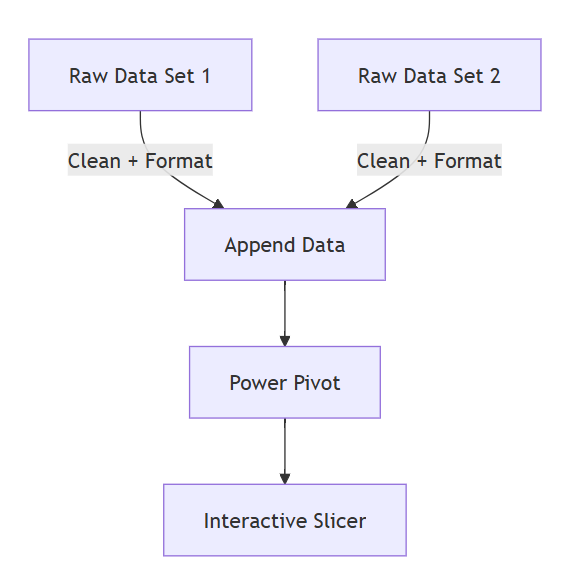

# Interactive Report Automation with Power Pivot
Pension Fund Interactive Report | Power Pivot | Excel | Data Transformation

> Project Overview: 

Automated a manual pension payroll reconciliation process using Excel Power Query and Power Pivot.
The solution transforms SSRS report exports into a dynamic reporting model with automated data preparation, reconciliation, and slicer-driven analysis.

> The Problem: 

- Manual filtering
- Multiple pivot tables
- Manual totals and member counts
- Separate SSRS exports by scheme type

> The Solution: 
1. **Power Query**
  - Cleaned and standardised two SSRS reports
  - Created individual transformed data tables
  - Replaced manual filtering with automated query steps
  - Appended datasets into a single reporting table
2. **Power Pivot**
  - Added DAX measures
  - Created interactive slicers by provider

# Process Documentation
> Key Transformations:
- Removed unnecessary columns
- Filtered required fund records
- Grouped rows for payroll aggregation
- Appended multiple datasets
- Created DAX measures in Power Pivot

> Process Flow Diagram

> Opportunities for Further Development
- Automated SSRS refresh integration
- Additional reconciliation checks
- KPI dashboard visuals
- Power BI migration
- Scheduled report automation

> About Me

I am a Pension Payroll Data Analyst with experience improving reporting processes through Excel automation, Power Query, Power Pivot, and data transformation techniques.
